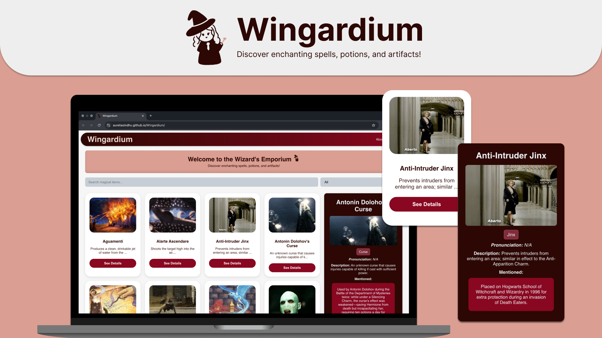

# [Wingardium](#)
> ### SEA Stage 2 - Data Catalog Project

<!-- ### built with:  -->
<!--   -->

   
 <strong> built with </strong> 

   
   
   

<!-- #### Source:  -->
<!-- data source: https://harrypotter.fandom.com/wiki/List_of_spells -->